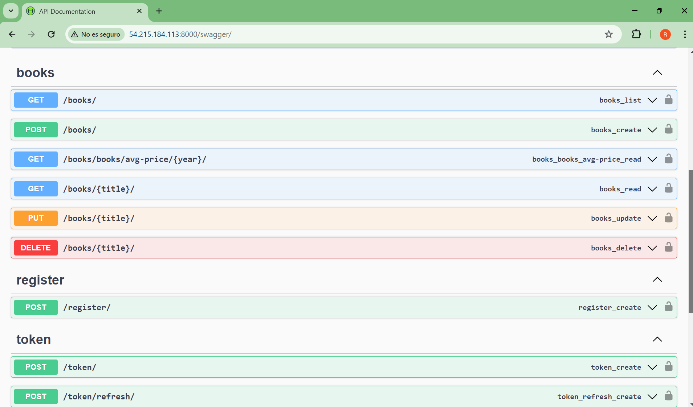
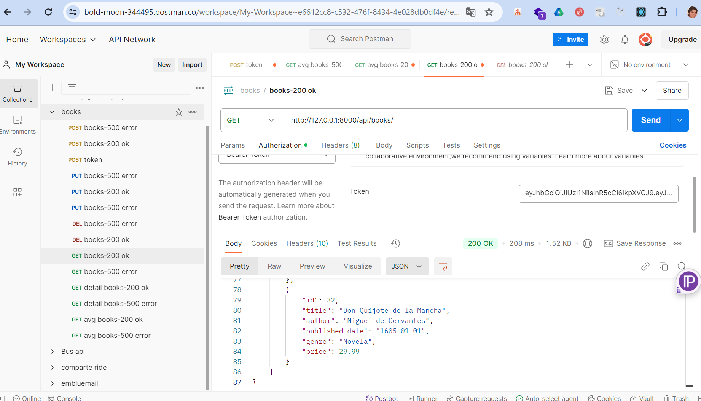
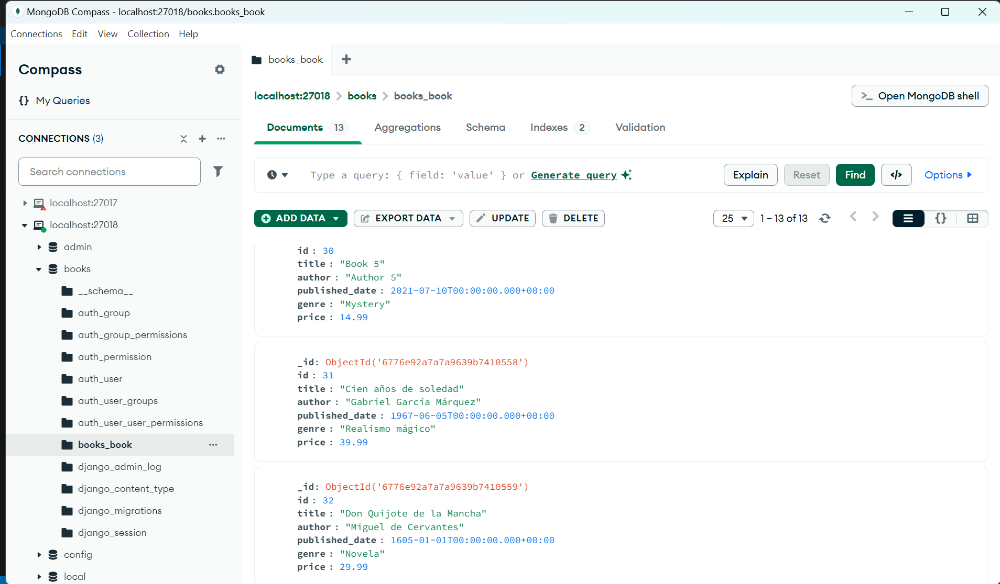
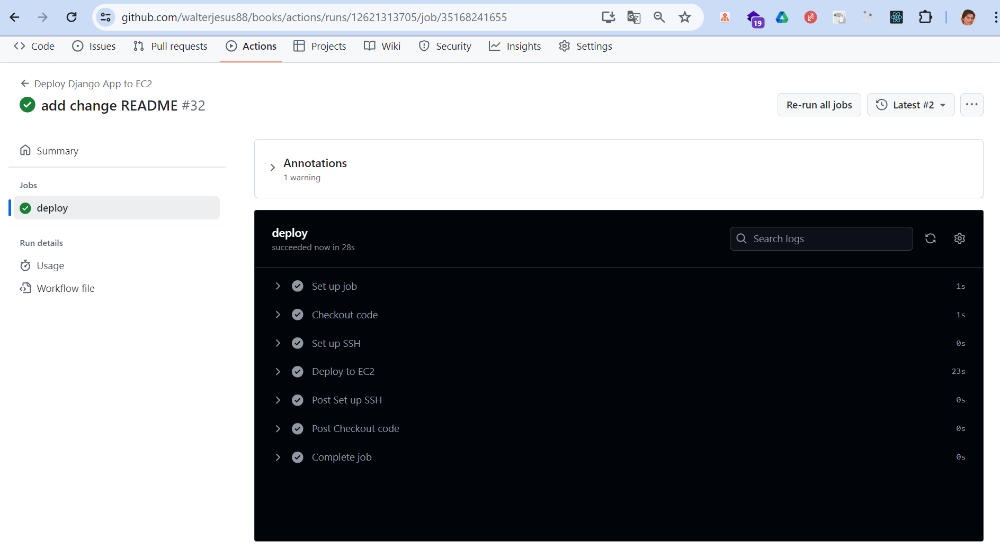
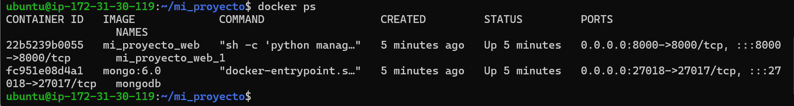

🛠 Tech Stack

<h1 align="center">Django REST Framework Docker & Docker Compose GitHub Actions (CI/CD) AWS EC2 (Deployment) </h1>

El desarrollo de este proyecto se hizo con las siguientes tecnologias
Swagger (API documentation)

🚀 Project Setup Instructions

1️⃣  
  Clone the Repository  

    git clone https://github.com/walterjesus88/books.git
    cd books

2️⃣ Build and Run with Docker

El proyecto está en contenedores utilizando Docker. Para compilar y ejecutar la API localmente, utilice el siguiente comando:

    docker-compose up --build

Esto creará las imágenes de Docker e iniciará los contenedores.

    docker-compose exec web python manage.py makemigrates
    docker-compose exec web python manage.py migrate   #creara las tablas de django y books

Para correr los test ejecuta lo siguiente:

    docker-compose exec web python manage.py test books

3️⃣ Swagger API Documentation 

El proyecto incluye Swagger para documentación API interactiva. Una vez que el servidor se esté ejecutando, puede acceder a la interfaz Swagger en:

    http://localhost:8000/swagger/ 

Aquí puede explorar todos los puntos finales de la API, ver los formatos de solicitud y respuesta y probar la API directamente desde el navegador.

4️⃣ GitHub Actions (CI/CD)

Este proyecto utiliza GitHub Actions para automatizar los procesos de prueba e implementación. El archivo de flujo de trabajo se define en el directorio .github/workflows/.

Cada envío al repositorio desencadena las siguientes acciones:

Ejecutar pruebas: garantiza que la aplicación funcione como se esperaba.

Crear imágenes de Docker: crea imágenes de Docker para la aplicación.

Implementar en EC2: implementa automáticamente la aplicación actualizada en la instancia EC2.

5️⃣ AWS EC2 Deployment

La aplicación se ha implementado en una instancia AWS EC2. A continuación se detallan los pasos seguidos para la implementación:

✅ Steps to Deploy on EC2:

Launch an EC2 Instance:

Ubuntu as the OS.

SSH into the Instance:

ssh -i <your-key.pem> ec2-user@<ec2-public-ip>

En este cado se uso el ip http://54.215.184.113/admin/

Se Instalo Docker y Docker Compose:

    sudo yum update -y
    sudo yum install docker -y
    sudo systemctl start docker
    sudo systemctl enable docker
    sudo curl -L "https://github.com/docker/compose/releases/download/1.29.2/docker-compose-$(uname -s)-$(uname -m)" -o /usr/local/bin/docker-compose
    sudo chmod +x /usr/local/bin/docker-compose

El github actions ya clona e instala dependencias para su funcionamiento

Run the Docker Containers:

    docker-compose up --build -d  #en caso de querer reiniciar

The application will be accessible at the EC2 public IP address on port 8000.

📚 API Endpoints

🔐 Authentication

The API requires authentication for certain endpoints. Users can register and log in to access protected endpoints.

🔍 Swagger Integration

Swagger se ha integrado para proporcionar una interfaz fácil de usar para explorar la API. Documenta automáticamente todos los puntos finales disponibles y proporciona una plataforma interactiva para probarlos.

    http://54.215.184.113:8000/swagger/ 
    
Puedes usar las siguientes credenciales.

Username: wjesus88

Password: 123456

📚 Books API

Method

Endpoint

Con esto obtienes el token para los demas recursos

    POST /api/token/

Description

    GET /api/books/

Retrieve all books

    POST /api/books/

Create a new book

    GET /api/books/{title}/

Retrieve a book by title

    PUT /api/books/{title}/

Update a book by title

    DELETE /api/books/{title}/

Delete a book by title

📊 Average Price API

Method Endpoint Description

    GET /api/books/avg-price/{year}/

Recuperar el precio medio de los libros para un año determinado.

🧑‍💻 User Registration API

Method Endpoint Description

    POST /api/register/

Register a new user

El desarrollo tiene paginacion para el method GET 
se uso Postman e insomnia para probar los Endpoints

Se uso Djongo para usar ORM Django 

Al hacer git push origin main, github actions hace el deploy automatico al servidor EC2

El servidor EC2 con la aplicacion Django REST en producción.

Por ultimo hay una colección en Postman con las llamadas a cada una de las APIs, que es el archivo 
    
    books.postman_collection.json

📞 Contacto

Para cualquier consulta puedes contactar con:

Author: Walter

Email: [wjesus88@gmail.com]